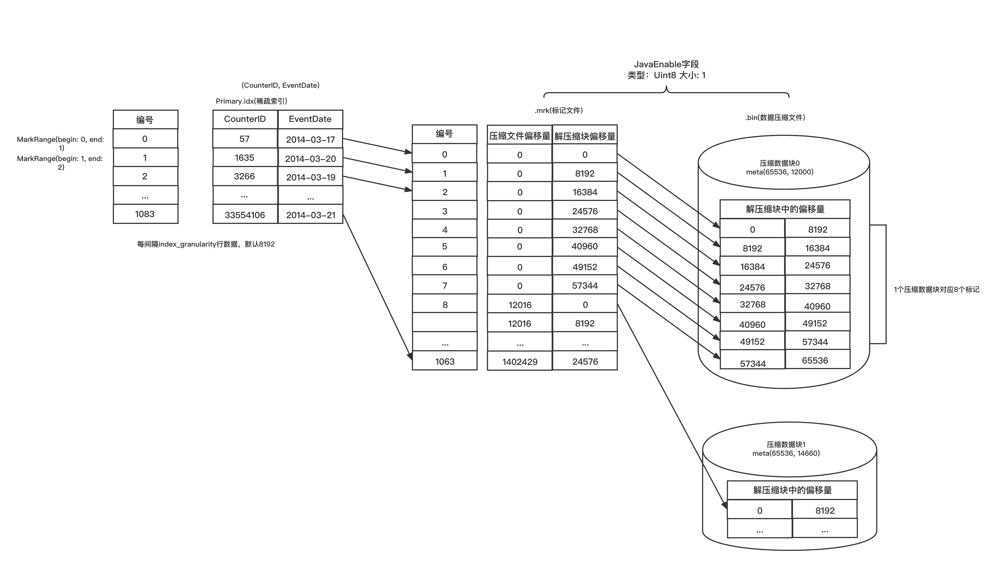
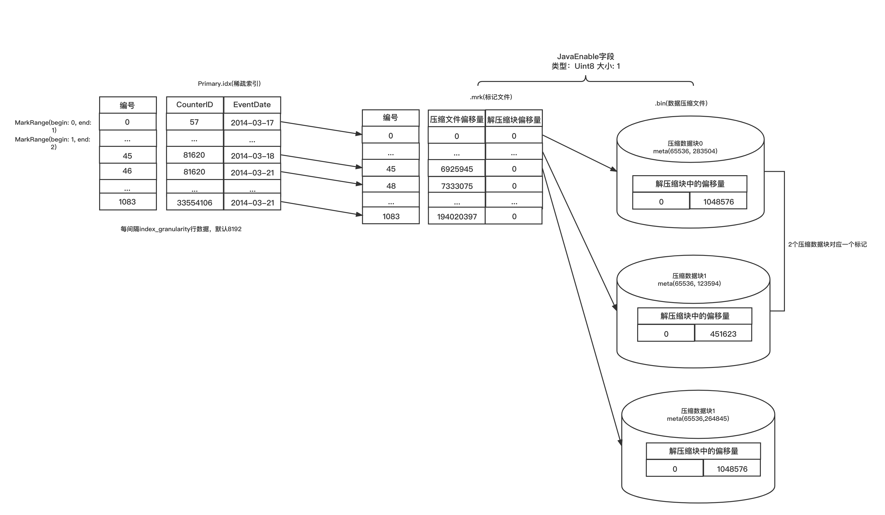

# MergeTree

在生产环境的绝大部分场景中都会使用MergeTree系列的表引擎。因为只有合并树系列的表引擎才支持主键索引、数据分区、数据副本和数据采样这些特性，同时也只有此系列的表引擎支持 `ALTER` 相关操作。

&nbsp;

## MergeTree完整工作流程

分区、索引、标记和压缩数据通过协同工作，完成数据的写入、查询。

&nbsp;

### 写入

数据写入第一步是生成分区目录，伴随着每一批数据的写入，都会生成一个新的分区目录。在后续的某一个时刻，属于相同分区的目录会依照规则合并到一起；接着，按照 `index_granularity` 索引粒度，会分别生成 `primary.idx` 一级索引(如果声明了二级索引，还会创建二级索引文件)、每一个列字段的`.mrk`数据标记和`.bin`压缩数据文件。如下图，是一张`MergeTree`表在写入数据时，它的分区目录、索引、标记和压缩数据的生成过程。

从分区目录 `201403_1_34_3` 得知，该分区数据共分34批写入，期间发生过3次合并。在数据写入的过程中，依据`index_granularity`的粒度，依次为每个区间的数据生成索引、标记和压缩数据块。其中，索引和标记区间是对齐的，而标记与压缩块则根据区间数据大小的不同，会生成多对一、一对一和一对三种关系。

&nbsp;

### 查询过程

数据查询的本质，可以看作一个不断减小数据范围的过程。在最理想的情况下，MergeTree首先可以依次借助分区索引、一级索引和二级索引，将数据扫描范围缩至最小。然后再借助数据标记，将需要解压与计算的数据范围缩至最小。如下图，它示意了最优的情况下，经过层层过滤，最终获取最小范围数据的过程。

如果一条查询语句没有指定任何`WHERE`条件，或指定了`WHERE`条件，但条件没有匹配到任何索引(分区索引、一级索引和二级索引)，那么MergeTree就不能预先减小数据范围。在后续进行数据查询时，它会扫描所有分区目录，以及目录内索引段的最大区间。**虽然不能减少数据范围，但是MergeTree仍然能够借助数据标记，以及多线程的形式同时读取多个压缩数据块，以提升性能。**

&nbsp;

### 数据标记与压缩数据的对应关系

由于压缩数据块的划分，与一个间隔(`index_granularity`)内的数据大小相关，**每个压缩数据块的体积都被严格控制在64KB~1MB。** 而一个间隔(`index_granularity`)的数据，又只会产生一行数据标记。根据一个间隔内数据的实际字节大小，数据标记和压缩数据块之间会产生三种不同的对应关系。

&nbsp;

#### 多对一

**多个数据标记对应一个压缩数据块**，当一个间隔(`index_granularity`)内的数据未压缩大小`size < 64KB` 时，会出现这种对应关系。

&nbsp;

#### 一对一

**一个数据标记对应一个压缩数据块**，当一个间隔(`index_granularity`)内的数据未压缩大小 `64KB <= size < 1MB`，会出现这种对应关系。

&nbsp;

#### 一对多

**一个数据标记对应多个压缩数据块**，当一个间隔(`index_granularity`)内的数据未压缩大小`size > 1MB`，会出现这种对应关系。

