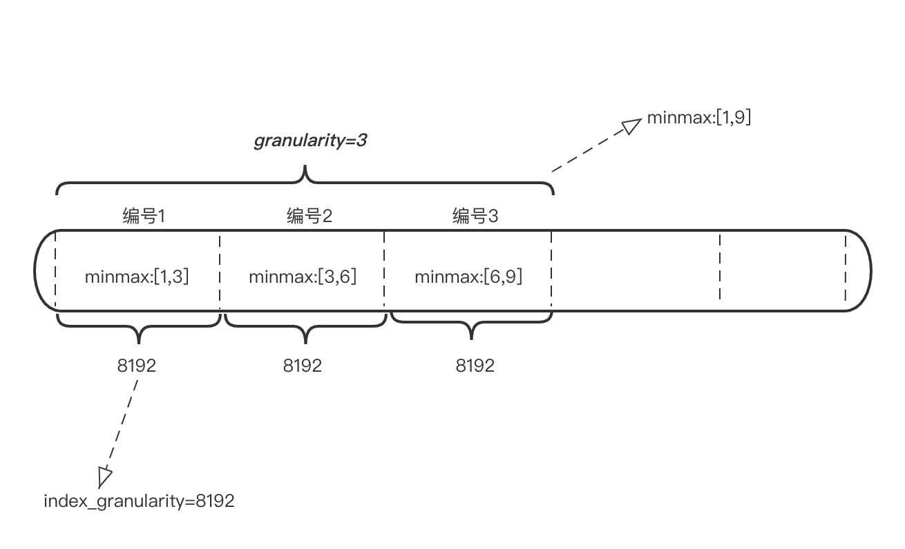

# 二级索引

除了一级索引外，MergeTree同样支持二级索引。二级索引又称跳数索引，由数据的聚合信息构建而成。根据索引类型的不同，其聚合信息的内容也不同。跳数索引的目的与一级索引一样，也是帮助查询时减少扫描的范围。

跳数索引在默认情况下时关闭的，可设置 `ALLOW_EXPERIMENTAL_DATA_SKIPPING_INDICES=1` 进行开启。

**跳数索引**需要在`CREATE`语句内定义，它支持使用元组和表达式的形式声明。

```SQL
INDEX index_name expr TYPE index_type(...) GRANULARITY granularity
```

如果在建表语句中声明了跳数索引，会额外生成相应的索引与标记文件(`skp_idx_[Column].idx` 与 `skp_idx_[Column].mrk`)。

&nbsp;

## granularity 与 index_granularity 关系

`index_granularity` 定义了数据的粒度，而 `granularity` 定义了聚合信息汇总的粒度。也就是说 `granularity` 定义了一行跳数索引能够跳过多少个 `index_granularity` 区间的数据。



&nbsp;

## 跳数索引的类型

MergeTree共支持4种跳数索引: `minmax`、`set`、`ngrambf_v1`、`tokenbf_v1`。一张数据表可以同时支持多个跳数索引：

```SQL
create table skip_test (
    ID String,
    URL String,
    Code String,
    EventTime Date,
    INDEX a ID TYPE minmax GRANULARITY 5,
    INDEX b (length(ID) * 8) TYPE set(2) GRANURAITY 5,
    INDEX c (ID, Code) TYPE ngrambf_v1(3, 256, 2, 0) GRANURAITY 5,
    INDEX d ID TYPE tokenbf_v1(256, 2, 0) GRANURAITY 5
)
```

&nbsp;

### minmax

`minmax` 索引记录了一段数据内的最小值和最大值，索引的作用类似分区目录的minmax索引，能够快速跳过无用的数据区间。

```SQL
// minmax 索引会记录这段数据区间内ID字段的极值。极值的计算涉及每个index_granularity区间中的数据。
INDEX a ID TYPE minmax GRANULARITY 5
```

&nbsp;

### set

`set` 索引直接记录了声明字段或表达式的取值(`set(max_rows)`)，`max_rows` 是一个阈值，表示在一个 `index_granularity` 内，索引最多记录的数据行数。如果 `max_rows=0`，表示无限制。

```SQL
// set 索引会记录数据中ID的长度 * 8后的取值。其中，每个index_granularity内最多记录100条
INDEX b(length(ID) * 8) TYPE set(100) GRANULARITY 5
```

&nbsp;

### ngrambf_v1

该索引记录的是数据短语的bf(布隆过滤器)，只支持 `String` 和 `FixedString` 数据类型。`ngrambf_v1` 只能够提升 `in`、`notIn`、`like`、`equals`、`notEquals` 查询的性能，完整形式为 `ngrambf_v1(n, size_of_bloom_filter_in_bytes, number_of_hash_function, random_seed)`。

* `n`：token长度，依据n的长度将数据切割为token短语。
* `size_of_bloom_filter_in_bytes`：布隆过滤器的大小。
* `number_of_hash_functions`：布隆过滤器中使用Hash函数的个数。
* `random_seed`：Hash函数的随机种子。

```SQL
// ngrambf_v1 索引按照3的粒度将数据切割成短语token，
// token会经过2个Hash函数映射后再被写入
// 布隆过滤器大小为256字节
INDEX c(ID, Code) TYPE ngrambf_v1(3, 256, 2, 0) GRANULARITY 5
```

&nbsp;

### tokenbf_v1

`tokenbf_v1` 索引是 `ngrambf_v1` 的变种，`tokenbf_v1` 除了短语 `token` 的处理方法外，其他与 `ngrambf_v1` 是完全一致的。 `tokenbf_v1` 会自动按照非字符的、数字的字符串分割tokens：

```SQL
INDEX d ID TYPE tokenbf_v1(256, 2, 0) GRANULARITY 5
```
