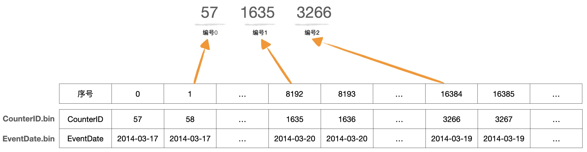
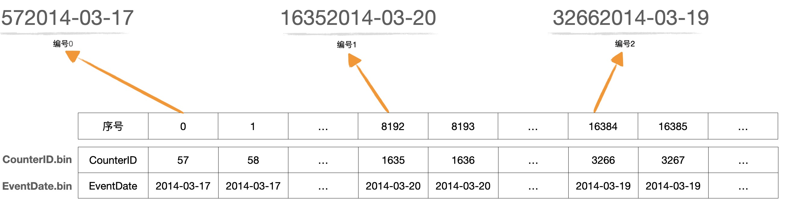
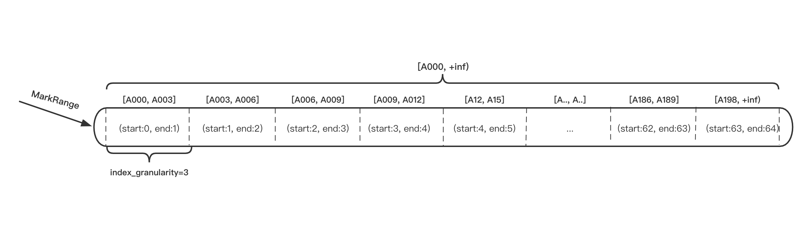

# 数据分区

MergeTree进行数据查询时，可以有效跳过无用的数据文件，只使用最小的分区目录子集。

* ClickHouse中，数据分区(partition)和数据分片(shard)是完全不同的概念。数据分区是针对本地数据而言，是对数据的一种纵向切分，MergeTree并不能依靠分区的特性，将一张表的数据分布到多个ClickHouse服务节点；
* 横向切分是数据分片(shard)的能力。

&nbsp;

## 数据分区规则

MergeTree数据分区规则由分区ID决定，具体到每个数据分区对应的ID， 由分区键的取值决定。分区键支持使用一个或者一组字段表达式声明，针对取值数据类型的不同，分区ID的生成逻辑有以下规则:

* **不指定分区键**：不设置分区键，分区ID默认取名`all`，所有数据都会被写入这个`all`分区。
* **整型**：分区键取值属于整型，且无法转换为日期类型(`YYYYMMDD`)格式，则直接按照整型的字符串形式输出，作为分区ID的取值。
* **日期**：如果分区键属于日期类型，或者能够转换为`YYYYMMDD`格式的整型，则使用 `YYYYMMDD` 进行格式化后字符串输出，并作为分区ID取值。
* **其他类型**： 如果分区键不属于整型、日期类型，例如`String`、`Float`类型等，则通过128位hash值作为分区ID的取值。

数据写入时，会按照分区ID落入相应的数据分区。如果通过元组的方式使用多个分区字段，格式如下：

```SQL
PARTITION BY (length(Code), EventTime)

# 生成如下格式
2-20190501
2-20190611
```

&nbsp;

### 分区命名规则

MergeTree分区目录的完整物理名称并不是只有ID，在ID之后还存在一串表示其他含义的数字。命名公式格式如下：

```SQL
PartitionID_MinBlockNum_MaxBlockNum_Level

# 201905: 分区目录的ID
# 1_1: 最小的数据块编号与最大的数据块编号
# _0: 目前合并的层级
# Eg: 201905_1_1_0  => PartitionID_MinBlockNum_MaxBlockNum_Level
```

* **partitionID**：分区ID
* **MinBlockNum 和MaxBlockNum**：最小数据块编号与最大数据块编号，该编号在表级别全局唯一。此处的数据块编号命名规则和分区目录合并后数据块编号格式相同，但代表的含义有所差异。默认情况下，新创建分区目录的 `MinBlockNum`和`MaxBlockNum` 相同(`201905_1_1_0`、`201905_2_2_0`)，当数据分区发生合并后，产生的目录名称会有新的含义。
* **Level**：合并的层级，表示在某个分区内被合并过的次数。Level编号是分区级别的惟一，之后以分区为单位，如果相同分区发生合并动作，在相应分区内计数器累加1。

&nbsp;

### 分区目录合并

MergeTree的分区目录并不是在数据表创建之后就存在的，而是在数据写入过程中被创建的。每一批数据的写入(一次`insert`操作)，MergeTree都会生成一批新的分区目录，即使不同批次写入的数据属于相同分区，也会生成不同的分区目录。在插入之后的某个时刻(写入后10～15分钟)，ClickHouse通过后台任务将属于相同分区的多个目录合并成一个新的目录。已经存在的旧分区目录并不会即刻被删除，而是在之后的某个时刻(默认8分钟)通过后台任务删除。

属于同一个分区的多个目录，在合并之后会生成一个全新的目录，目录中的索引和数据文件会进行合并。新的目录格式如下：

* **MinBlockNum**：取同一个分区所有目录中最小的`MinBlockNum`值。
* **MaxBlockNum**：取同一个分区所有目录中最大的`MaxBlockNum`值。
* **Level**：取同一个分区内最大`Level`值并加1。

&nbsp;

## 一级索引

MergeTree主键定义后，会根据 `index_granularity` 间隔(默认8192行)，为数据生成一级索引并保存至 `primary.idx` 文件内，索引数据按照 `PRIMARY KEY` 排序。相比使用 `PRIMARY KEY` 定义，更为常见的简化形式是通过 `ORDER BY` 指定主键。此时，`PRIMARY KEY` 与 `ORDER BY` 定义相同，所以索引(`primary.idx`) 和 数据(`.bin`)会按照完全相同的规则排序。

&nbsp;

### 稀疏索引

`primary.idx` 一级索引采用稀疏索引实现。相比于**稀密索引** 每一行索引标记都会对应一行具体的数据记录；而**稀疏索引**中，每一行索引标记对应的是一段数据，而不是一行。

稀疏索引的优势是，它仅用少量的索引标记就能够记录大量数据的分区位置信息，且数据量越大优势越明显。以默认的索引粒度(8192)举例，MergeTree只需要12208行索引就能为1亿行数据记录提供索引。稀疏索引占用空间小，`primary.idx` 内的索引数据常驻在内存，取用速度自然极快。

&nbsp;

### 索引粒度

ch提供了自适应粒度大小的特征，默认索引粒度为8192。数据以 `index_granularity`的粒度被标记成多个小的区间，其中每个区间最多8192行数据。MergeTree使用`MarkRange` 表示一个具体的区间，并通过 `start` 和 `end` 表示其具体的范围。

`index_granularity` 同时会影响数据标记(`.mark`)和数据文件(`.bin`)。仅有一级索引自身无法完成查询工作，需要借助数据标记才能定位数据，所以一级索引和数据标记的间隔粒度相同(`index_granularity`)，彼此对齐。数据文件也会按照 `index_granularity`的间隔粒度生成压缩数据块。

&nbsp;

#### 索引数据的生成规则

由于是稀疏索引，所以MergeTree需要间隔 `index_granularity` 行数据才会生成一条索引记录，索引值会根据声明的主键字段获取。

&nbsp;

##### CounterID 作为索引

如果使用 `CounterID` 作为主键(`order by counterID`)，则每间隔8192行数据就会取一次 `counterID`的值作为索引值，索引数据最终会被写入`primary.idx` 文件进行保存。



&nbsp;

##### 使用多主键作为索引

如果使用多个主键，例如 `order by (CounterID, EventDate)`，则每间隔8192行可以同时取 `CounterID` 与 `EventDate` 两列作为索引值。



&nbsp;

### 索引查询过程

#### MarkRange

MergeTree 按照 `index_granularity` 的间隔粒度，将一段完整的数据分成了多个小的间隔数据段，一个具体的数据段就是一个MarkRange。

MergeTree与索引编号对应，使用 `start` 和 `end` 两个属性表示区间范围。通过与 `start` 及 `end` 对应的索引编号取值，能够得到它所对应的数值区间。数据区间表示了此 MarkRange包含的数据范围。

MergeTree的索引粒度 `index_granularity=3`,根据索引的生成规则,用如下示意图表示：


