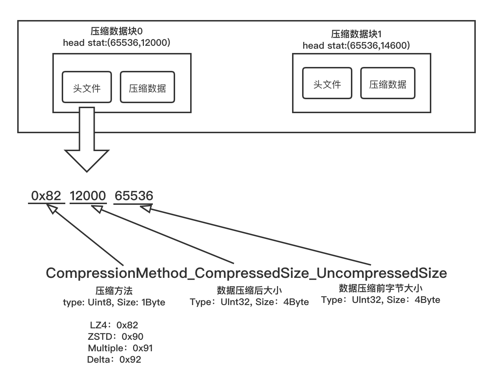
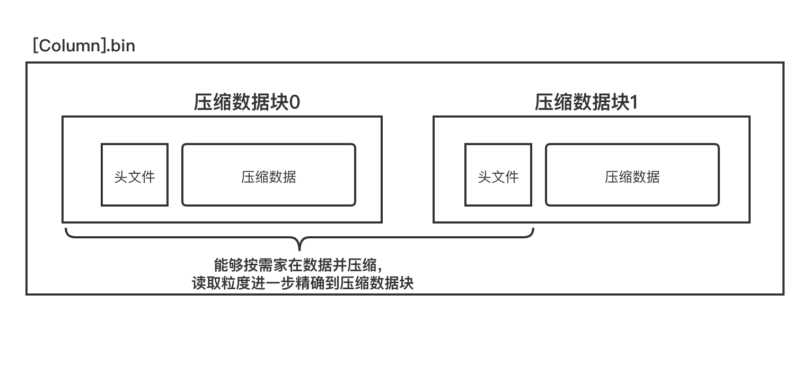

# 数据存储

## 各列独立存储

MergeTree存储引擎中，数据按列存储。每个列字段都拥有一个与之对应的`.bin`数据文件。数据文件以分区目录的形式被组织存放，所以在 `.bin` 文件中只会保存当前分区片段内的这一部分数据。按列独立存储有以下优势：

* 可以更好地进行数据压缩(相同类型的数据放在一起，怼压缩更加友好)。
* 能够最小化数据扫描的范围。

MergeTree 并不是一次性地将数据直接写入`.bin`文件，而是经过了精心设计： 
* 数据是经过压缩的，目前支持LZ4、ZSTD、Multiple和Delta几种算法，默认使用LZ4算法
* 数据会实现按照`ORDER BY`的声明排序
* 数据是以压缩数据块的形式被组织并写入`.bin`文件中的。

&nbsp;

## 压缩数据块

一个压缩数据块由头部和压缩数据两部分组成。头信息固定使用9位字节表示，具体由1个UInt8(1字节)整形和2个UInt32(4字节)整形组成，分别代表使用的压缩算法类型、压缩后的数据大小和压缩前的数据大小。

每个压缩数据块的体积，按照其压缩前的数据字节大小，都被严格控制在`64KB ~ 1MB`，上下限分别由 `min_compress_block_size`(默认65536)与 `max_compress_block_size`(默认1048576)参数指定。一个压缩数据块最终的大小和一个间隔(`index_granularity`)内数据的实际大小相关。

MergeTree在数据具体的写入过程中，会按照索引粒度(默认情况下，每次取8192行)，按批次获取数据并进行处理。写入规则如下：

* **单个批次数据`size < 64KB`**：如果单个批次数据小于64KB，则继续获取下一批数据，知道累积到 `size > 64KB` 时，生成下一个压缩数据块。
* **单个批次数据`64KB <= size <= 1MB`**：如果单个批次数据大小恰好在64KB与1MB之间，则直接生成下一个压缩数据块。
* **单个批次数据`size > 1MB`**：如果单个批次数据直接超过1MB，则首先按照1MB大小截断并生成下一个压缩数据块。剩余数据继续按照上述规则执行。

一个 `.bin` 文件是由1个至多个压缩数据块组成的，每个压缩块大小在`64KB~1MB`之间。多个压缩数据块之间，按照写入顺序收尾相接，紧密地排列在一起。

`.bin` 文件中引入压缩数据块的目的有以下亮点:

&nbsp;

### 减小数据大小

虽然数据被压缩后能够有效减少数据大小，降低存储空间并加速数据传输效率，但数据的压缩和解压动作，其本身也会带来额外的性能损耗。所以需要控制被压缩数据的大小，以求在性能损耗和压缩率之间寻求一种平衡。

&nbsp;

### 缩小读取范围

在具体读取某一列数据时(`.bin`文件)，首先需要将压缩数据家在到内存并解压，这样才能进行后续的数据处理。通过压缩数据块，可以在不读取整个`.bin`文件的情况下将读取粒度降级到压缩数据块级别，从而进一步缩小数据读取的范围。

