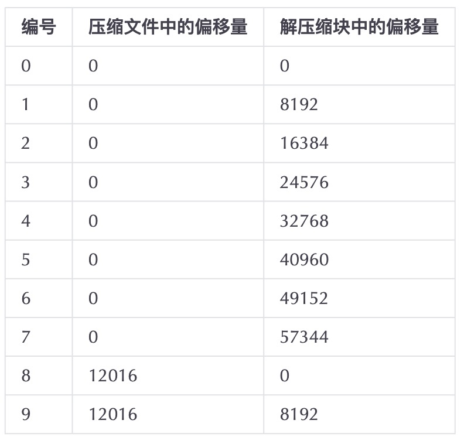

# 数据标记

如果将MergeTree比做一本书，`primary.idx` 一级索引好比这本书的一级章节目录，`.bin`文件中的数据好比这本书中的文字，那么数据标记(`.mrk`)会为一级章节目录和具体的文字之间建立关联。

对于数据标记而言，它记录了两个重要信息：

* 一级章节对应的页码信息
* 一段文字在某一页中的起始位置信息

通过数据标记就能够很快地从一本书中立即翻出到关注内容所在的那一页，并知道从第几行开始阅读。

&nbsp;

## 数据标记的生成规则

数据标记作为衔接一级索引和数据的桥梁，就像做过标记小抄的书签，而且书本中每个一级章节都拥有各自的书签。

数据标记和索引区间是对齐的，均按照`index_granularity`的粒度间隔。如此一来，只需要简单通过索引区间的下标编号就可以直接找到对应的数据标记。

为了能与数据衔接，数据标记文件也与`.bin`文件一一对应。每一个列字段`[Column].bin`文件都有一个与之对应的`[Column].mrk`数据标记文件，用于记录数据在`.bin`文件中的偏移信息。

一行标记数据使用一个元组表示，元组内包含两个整列数值的偏移量信息。它们分别表示在此段数据区间内，在对应的`.bin`压缩文件中，压缩数据块的起始偏移量；以及将该数据压缩块解压后，其未压缩数据的起始偏移量。

每一行标记数据都表示了一个片段的数据(默认8192行)在`.bin`压缩文件中的读取位置信息。**标记数据与一级索引数据不同，它并不能常驻内存，而是使用LRU(最近最少使用)缓存策略加快取出速度。**

&nbsp;

## 数据标记的工作方式

MergeTree在读取数据时，必须通过标记数据的位置信息才能够找到所需要的数据。整个查找过程大致可以分为**读取压缩数据块和读取数据**两个步骤。如下所示，`JavaEnable` 字段及其标记数据与压缩数据的对应关系：

MergeTree通过两个步骤定位压缩数据块并读取数据的。

&nbsp;

### 读取压缩数据块

在查询某一列数据时，MergeTree无须一次性加载整个 `.bin` 文件，而是可以根据需要，只加载特定的压缩数据块。而这项特性需要借助标记文件中所保存的压缩文件中的偏移量。

如上实例的标记数据中，上下相邻的两个压缩文件中的起始偏移量，构成了与获取当前标记对应的压缩数据块的偏移量区间。由当前标记数据开始，向下寻找，直到找到不同的压缩文件偏移量为止。此时得到的一组偏移量区间即是压缩数据块在 `.bin` 文件中的偏移量。

&nbsp;

### 读取数据

在读取压缩后的数据时，MergeTree并不需要一次性扫描整段解压数据，它可以根据需要，以 `index_granularity` 的粒度加载特定的一小段。为了这项特性，需要借助标记文件中保存的解压数据块中的偏移量。

如上实例所示的标记数据中，上下相邻两个解压缩数据块中的起始偏移量，构成了与获取当前标记对应的数据的偏移量区间。通过这个区间，能够在它的压缩块被解压之后，依照偏移量按需读取数据。
