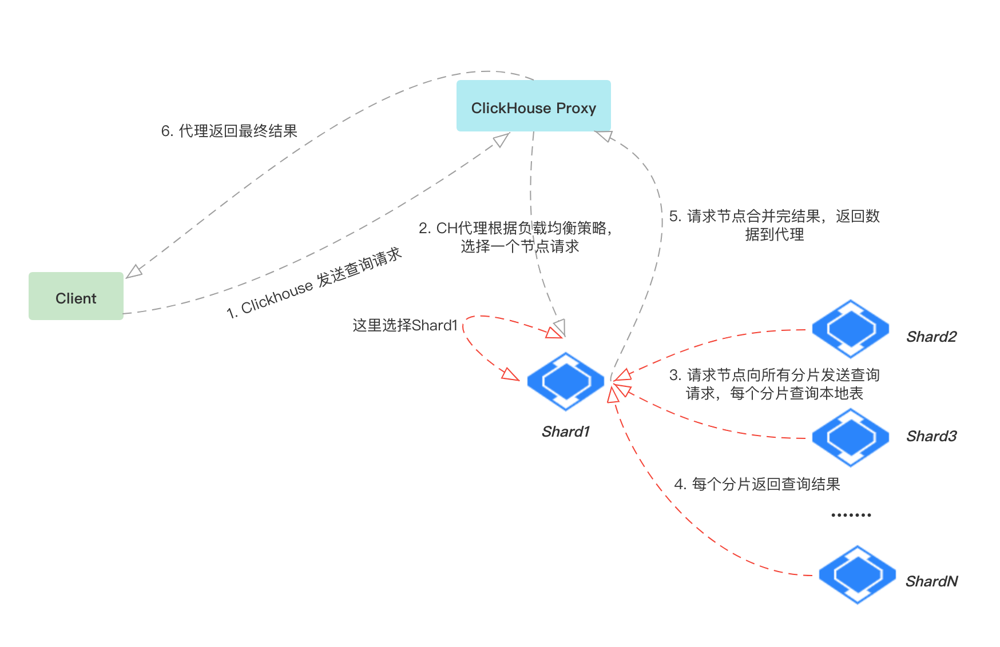

# 查询流程

## Distributed表数据查询流程

* Client发送查询语句到Clickhouse代理(Http)，同时查询语句一般会设定分区范围进行查询。
* ClickHouse 代理根据负载均衡策略，选取一个请求节点（集群中的一个分片），将查询语句转到请求节点中。
* 请求节点将语句转换，比如如果用到了 Distributed 表，将其转成文为本地表，之后将查询语句请求到 ClickHouse 集群所有分片进行数据查询。
* 每个分片执行完查询语句后，返回结果给请求节点。
* 请求节点根据用户的查询逻辑，合并最终的结果，并返回给 ClickHouse 代理。
* 最终，ClickHouse 代理将结果返回给客户端，业务层进行数据的使用。

在分片上执行查询语句时，会根据查询语句中的分区范围，先进行分区级别的数据过滤。之后在满足分区条件的目录中，通过 primary.idx 文件，结合索引键的取值范围，查询出索引编号的范围，然后通过查询列的 [Column].mrk 文件，找到其 [Column].bin 文件中的偏移量对应关系，最终将数据加载到内存进行分析和计算。
