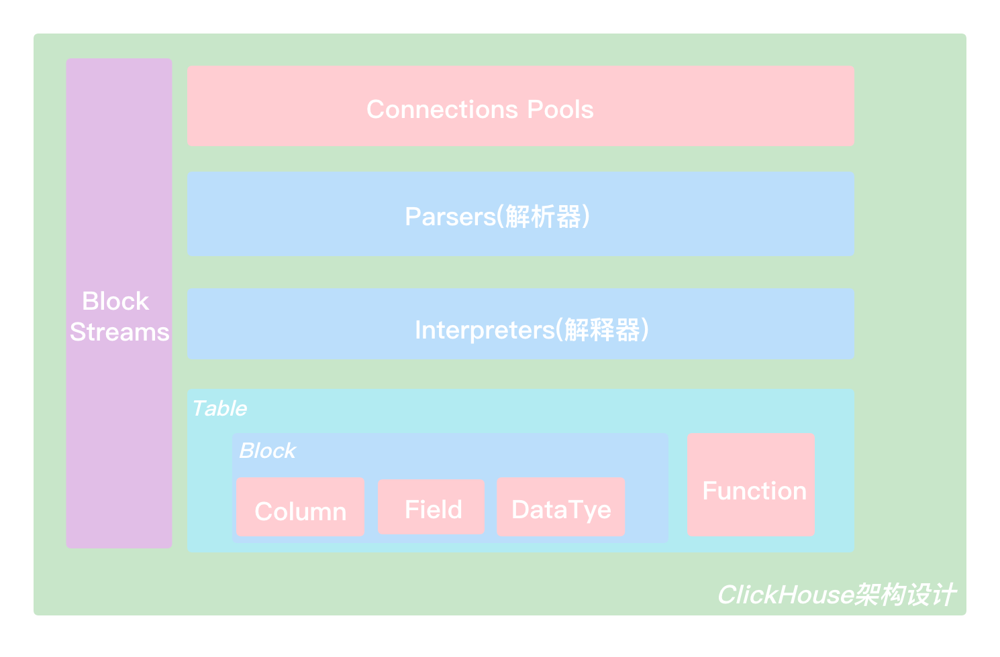
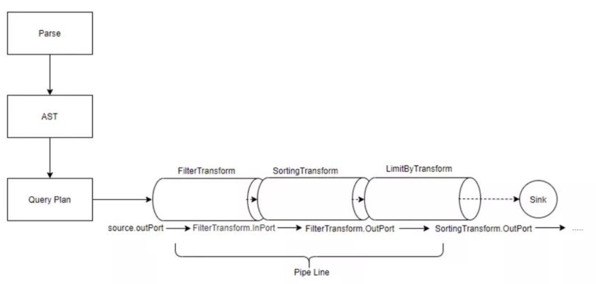

# ClickHouse架构

Clickhouse 的数据结构类似于关系型数据库，包括解析器，主要负责将SQL语句通过词法分析和语法分析，转化为计算机可以读取的抽象语法树。 另外，优化器负责优化抽象语法树的逻辑，比如简化一些冗长难懂的表达式，做一些语义优化。 物理优化负责生成可以直接执行的物理执行计划，指导数据库管理系统如何获取数据表，如何对数据进行join和排序等。

&nbsp;

### Column与Field

`Column` 和 `Field` 是Clickhouse数据最基础的映射单元。Clickhouse按列存储数据，内存中的一列数据由一个 `Column` 对象表示，`Column` 对象分为接口和实现两部分。如果需要操作单个值(单列中的一行数据)，需要使用 `Field` 对象，`Field` 对象代表一个单值。

### DataType

DataType负责数据的序列化和发序列化，`IDataType` 接口定义了许多正反序列化的方法。DataType 虽然负责序列化先关工作，但它并不直接负责数据的读取，而是转由从 `Column` 或 `Field` 对象获取。

&nbsp;

### Block 与 Block流

Clickhouse内部的数据操作是面向Block对象进行的，并且采用了流的形式。Block对象可以看作数据表的子集。Block对象的本质是由 **数据对象、数据类型和列名称** 组成的三元组，即 `Column`、`DataType`及列名称字符串。

`Column` 提供了数据的读取能力，而 `DataType` 知道如何正反序列化，所以 `Block`在这些对象的基础之上实现了进一步的抽象和封装，从而简化了整个使用的过程，仅通过Block对象就能完成一系列的数据操作。

&nbsp;

### Table

在数据表的底层设计中，并没有所谓的Table对象，它直接使用 `IStorage` 接口指代数据表。表引擎是Clickhouse一个显著特征，不同的表引擎由不同的子类实现，例如 `IStorageSystemOneBlock`(系统表)、`StorageMergeTree`(合并树引擎)和`StorageTinyLog`(日志引擎)等。

`IStorage` 接口定义了DDL(`ALTER`、`RENAME`、`OPTIMIZE`、`DROP`)、`read` 和 `write`方法，它们分别负责数据的定义、查询和写入。

对 `Table` 发起的一次操作通常都会经历这样的过程，接收 `AST`查询语句，根据 `AST` 返回指定列的数据，之后再将数据交由 `Interpreter` 做进一步处理。

&nbsp;

### Parser与Interpreter

`Parser` 分析器负责创建AST对象；`Interpreter`解释器负责解释AST, 并进一步创建查询的执行管道。

`Interpreter` 解释器的作用就像 `Service` 服务层一样，起到串联整个查询过程的作用，它会根据解释器的类型，聚合它所需要的资源。首先它会解析AST对象；然后执行「业务逻辑」(分之判断、设置参数、调用接口等)；最终返回 `IBlock` 对象，以线程的形式建立起一个查询执行管道。

&nbsp;

### Functions 与 Aggregate Functions

Clickhouse 主要提供了两类函数：普通函数和聚合函数。

普通函数由 `IFunction` 接口定义，拥有数十种函数实现，例如 `FunctionFormatDateTime`、`FunctionSubstring`等。

聚合函数由 `IAggregateFunction` 接口定义，相比无状态的普通函数，聚合函数是有状态的。

&nbsp;

### Cluster 与 Replication

Clickhouse的集群由分片(Shard)组成，而每个分片又通过副本(Replica)组成。

**ClickHouse的一个节点只能拥有一个分片** ，也就是说如果要实现1分片、1副本，则至少需要部署2个服务节点。

分片只是一个逻辑概念，其物理承载还是由副本承担的。分片更像是逻辑层的分组，在物理存储层则统一用副本代表分片和副本。

&nbsp;

## 数据流图

Clickhouse 的物理执行计划可以看成是一个数据流图，即数据的有向无环图。 在此图中，数据从一个管道传递到另一个管道，即从一个操作员传递到另一个管道。 查询执行器是用于执行计划的引擎。 它从存储引擎获取数据并将其返回给客户端。

Clickhouse在启动时加载配置信息，然后根据不同的解析协议监听不同的服务端口。 客户端发出SQL请求后，会先解析SQL语法，然后生成抽象语法树，并进行一系列的逻辑优化和物理优化，生成执行计划。 接下来，不同的执行器根据SQL请求将执行计划分发到本地或远程存储引擎，并从存储引擎中获取数据。 经过一系列的计算和处理，数据返回给客户端，客户端可以输出缓冲区读取查询结果。
